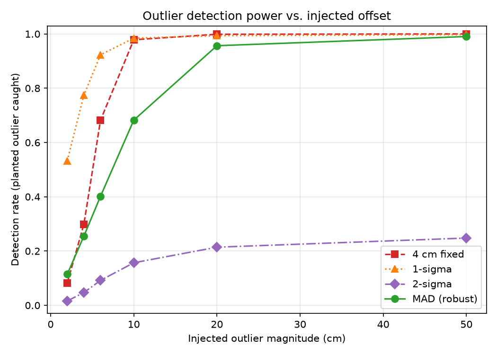
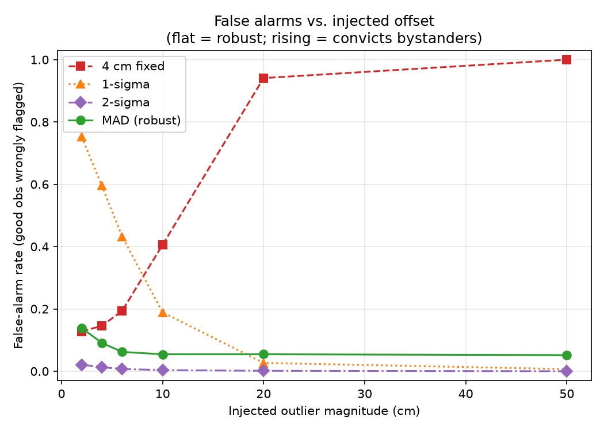
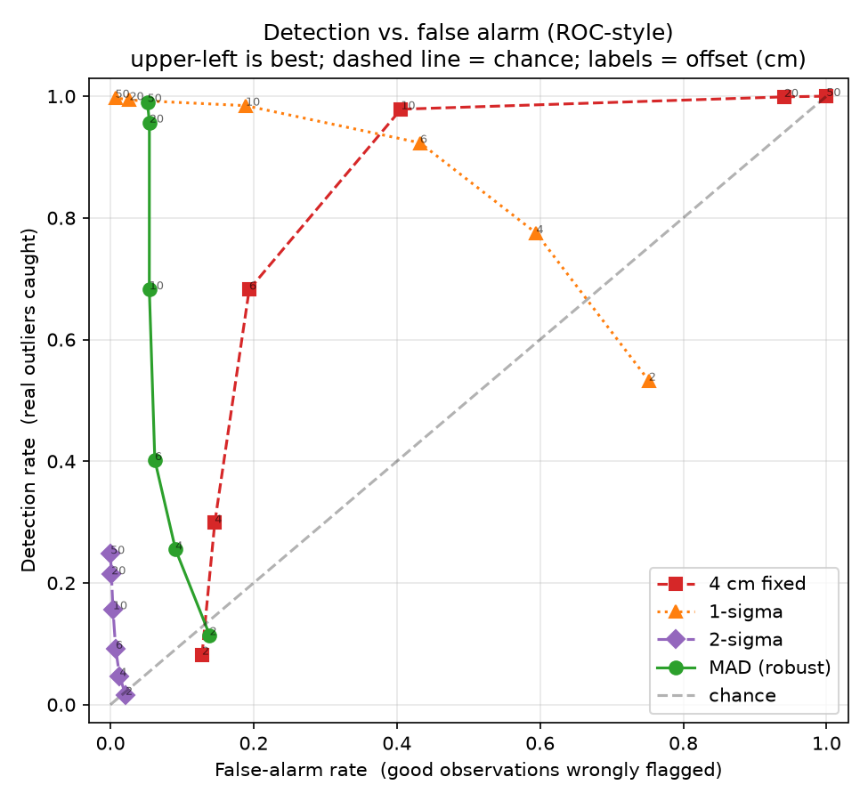
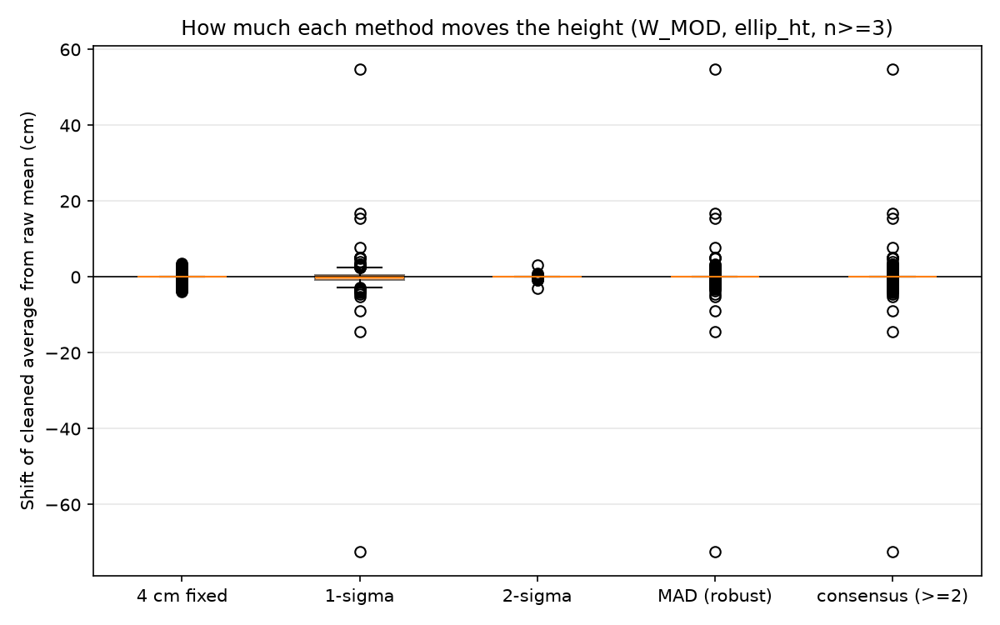
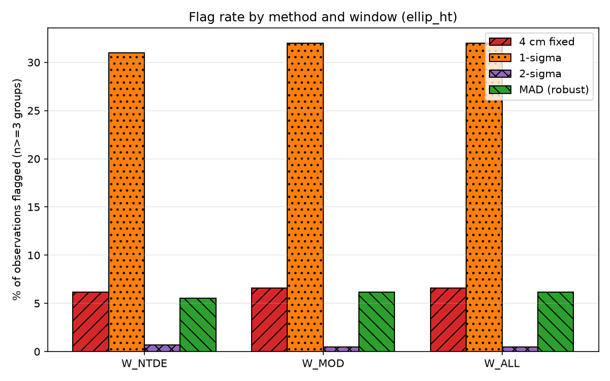
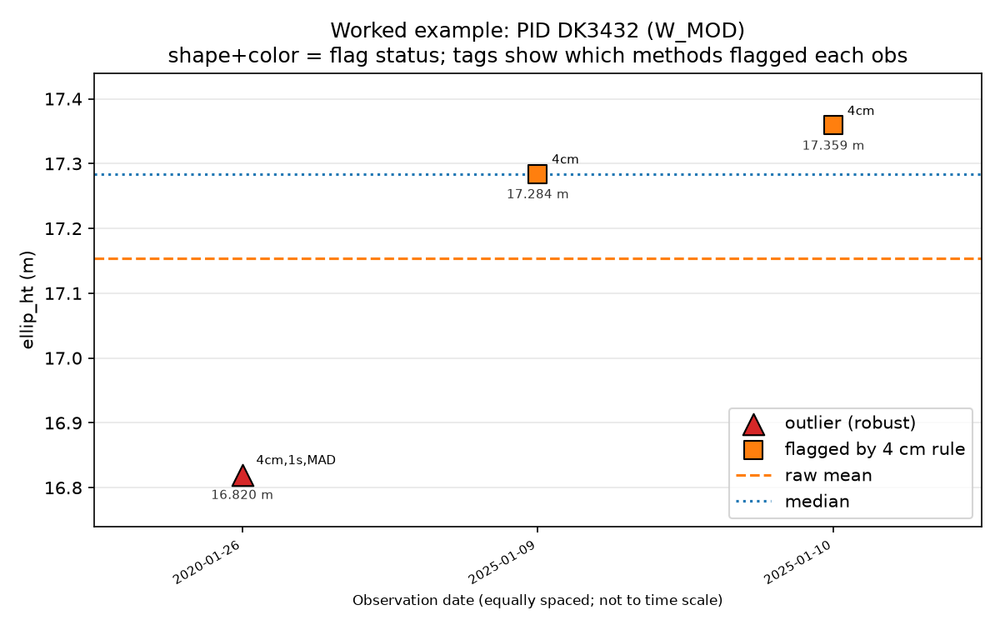
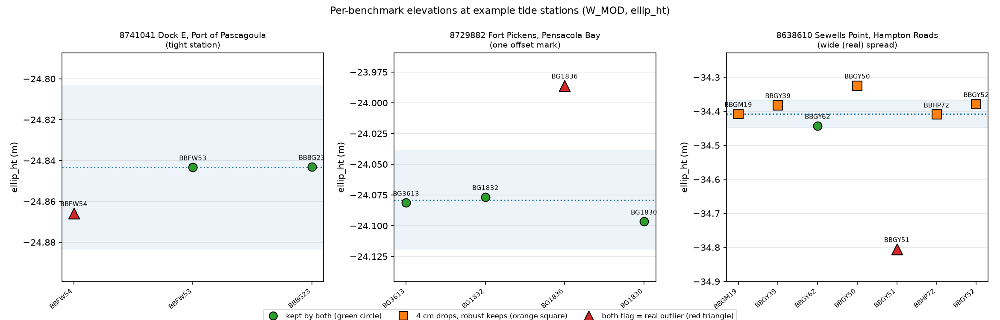
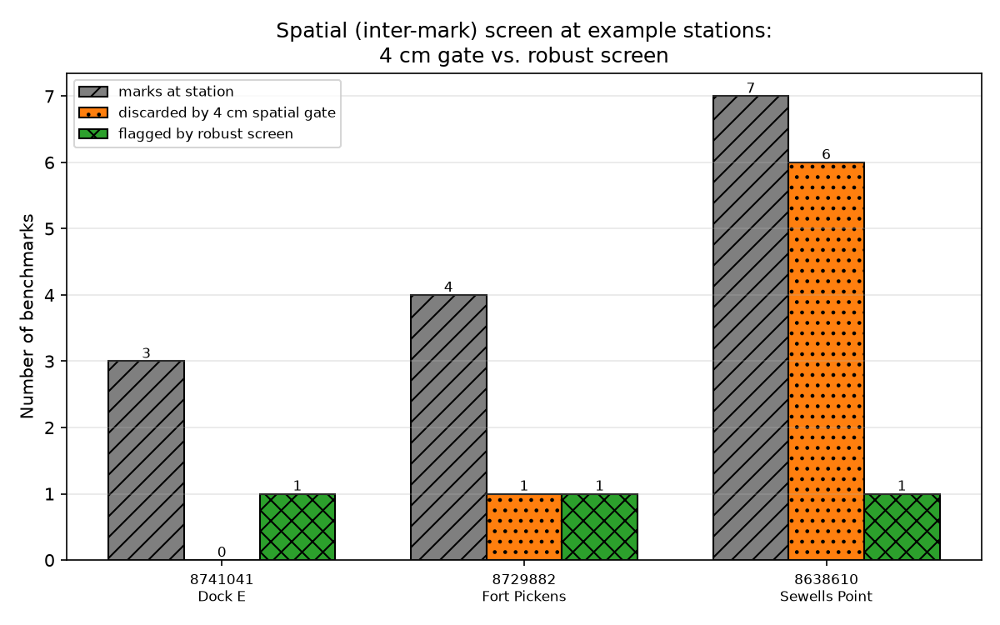

# Outlier Detection for OPUS Benchmark Elevations
## In-Depth Analysis and Methodology

**Author:** Nathan Murry
**Affiliation:** NOAA / NOS / CO-OPS
**Date:** August 4, 2026
**Analysis assisted by:** Claude Opus 4.8 (AI assistant) via USAi.gov (see acknowledgment below.)

*This document contains the full rationale, methodology, and results for technical review.*

---

## 1. Problem statement

NOAA CO-OPS tidal benchmarks are increasingly observed with GPS through the NGS
OPUS program. A single benchmark (identified by its NGS **PID**) is often
occupied multiple times across many years. To relate a mark's **geodetic**
elevation to its station's **tidal** datums for the NAPGD2022 effort, we require
one representative elevation per mark — and, ultimately, one representative **geodetic** value for the tide station.  This is critical to relating tide station datum and tidal benchmarks to the local and wider geodetic network.  This is also a critical value for the upcoming NAPGD2022 web mapping application and for use on the CO-OPS website datums pages and the CO-OPS web API.  The join tables and results in this report concern the population that matters for that tie: **CO-OPS benchmarks that also carry OPUS solutions. IDB solutions are NOT considered at this time.**

### 1.0 Two dimensions of elevations: temporal (observations per mark over time) and spatial (tidal benchmarks in a given tide station's local network.)

Producing a station geodetic value from raw OPUS observations involves **two
distinct statistical questions**, which the legacy practice conflates:

1. **Temporal / intra-mark.** A benchmark is occupied many times; the repeat
   observations form a small time series. *Which observations of the same mark
   should be combined into that mark's elevation?* (Sections 3–5.)
2. **Spatial / inter-mark.** A tide station carries several benchmarks; the
   station's value is formed by combining their per-mark elevations. *Which marks
   agree well enough to be considered in determining a representative elevation value per station?* (Section 7.)

The two questions are different in kind. Temporal scatter at a mark is
*measurement error* (the truth is one number, and departures are noise or
blunders). Spatial scatter across marks is partly *real physical difference* —
marks sit on different structures, settle at different rates, and were set at
different times — so a mark that differs from its neighbors is not necessarily
wrong. This distinction matters for what follows: a rule that is merely
suboptimal temporally can be actively harmful spatially, because spatially it may
discard *good* control.

Repeat observations of the same mark scatter for two reasons:
1. **Ordinary measurement noise** — normal GPS/OPUS variability (typically a few cm).
2. **Blunders (that is, true outliers)** — a bad antenna-height entry, a poor occupation, a wrong record, etc.

We must combine the observations into a single elevation **without letting a
blunder corrupt the result** — i.e., we need outlier detection on the *time
series of observations for each mark* — and then combine marks into a station
value without discarding legitimate control.

### 1.1 Why the legacy 4cm tolerance approach does not quite answer either question

Current CO-OPS practice applies a **4 cm tolerance** to **both** dimensions: among repeated observations of a mark (temporal) *and* among different marks at a station (spatial). A single fixed tolerance about an average is often a poor fit for the temporal question (Sections 3–5) and an even worse fit for the spatial one (Section 7).  Across marks it will reject perfectly good benchmarks whose elevation is farther from the group average, which is inflated by the very spread it is trying to police. This study evaluates robust alternatives for both levels and compares them head-to-head.

### 1.2 The fundamental limitation: no ground truth

There is **no answer key** for real observations — we can never be certain which
occupation was truly a blunder. This means **no method can be validated by "did
it find the true outlier."** We therefore define "best" operationally:

- **Robustness** — resistance to being fooled by the outlier itself (masking).
- **Stability** — how little the resulting elevation moves under the method.
- **Behavior under a controlled experiment** — where we *inject* known outliers
  and can measure detection and false-alarm rates against a manufactured truth.

This framing is stated plainly so the recommendation rests on measurable
properties, not on an untestable claim of "correctness."

---

## 2. Data

- **Source:** OPUS observation dump (`OPUS__3-10-26.xlsx`) and CO-OPS tidal-datum
  table (`CO-OPS__3-12-26.xlsx`) that I derived from the NGS OPUS GIS feature layer (updated daily) and the CO-OPS benchmark roster according to the CO-OPS database as of 3/13/2026.
- **OPUS:** 8,127 observations across **3,330 unique PIDs**; observation dates
  span between **6/2001 and 9/2025**. One row per observation (many per mark).
- **CO-OPS:** tidal datums, one row per PID, per station, and some PIDs serve more
  than one station.
- **Heights analyzed independently:** the GRS80 ellipsoid elevation (the direct GPS
  observable) and orthometric height (computed by NGS). The ellipsoid is used for the headline results because it avoids geoid-model error; orthometric elevation is carried in parallel.
- **Reference frame:** OPUS heights are NAD83(2011) at nominal observation epoch 2010.0, (fixed frame.)  **Intra**-mark horizontal positioning scatter is therefore treated as measurement error and not crustal motion, as NAD83(x) does not consider crustal motion in its realizations.  As such, there is no HTDP transformation to another reference frame applied.

### 2.1 Temporal windows

Observations are analyzed within three (nested) windows aligned to the National
Tidal Datum Epoch structure:

| Window | Range | Purpose |
|---|---|---|
| `W_NTDE` | 2002-01-01 – 2020-12-31 | New NTDE timeframe, 83-01 values |
| `W_MOD` | 2002-01-01 – present | Modern era, 83-01 values |
| `W_ALL` | all observations | Complete record |

An originally proposed 1983–2001 window was dropped: OPUS effectively did not
exist before ~2001, so that window contains a single observation. In practice
`W_MOD` and `W_ALL` differ by exactly one observation (a lone 2001 point), so the
substantive comparison is **W_NTDE vs. W_MOD**.

### 2.2 Group-size profile (a key structural finding)

Not every mark can be studied. Outlier detection needs at least 3 observations.

| Window | Total PIDs | n = 1 | n = 2 | **n ≥ 3 (studyable)** |
|---|---|---|---|---|
| W_NTDE | 2,325 | 1,147 | 720 | **458** |
| W_MOD | 3,329 | 898 | 1,370 | **1,061** |
| W_ALL | 3,330 | 899 | 1,370 | **1,061** |

**~68–80% of marks have only 1 or 2 observations** (68% in W_MOD, rising to 80% in
the narrower W_NTDE window) and cannot be assessed by any outlier method. This is a
property of the observation record, not a shortcoming of any method, and it bounds
how much of the network the methodology can affect.

**Group-size policy:**
- `n = 1` — keep the single value (`single_obs`).
- `n = 2` — plain mean (`mean_n2`); standard deviation and MAD are meaningless at n=2.
- `n ≥ 3` — full four-method comparison.

All marks — including n<3 — still join to CO-OPS; only the *detection* step is
skipped for small groups.

---

## 3. Methods

For a group of observations {x₁ … xₙ} of one mark in one window:

| ID | Rule | Center used | Robust? |
|---|---|---|---|
| `fixed` | flag if \|xᵢ − mean\| > **0.04 m** | mean | No |
| `s1` (1σ) | flag if \|xᵢ − mean\| > **1·std** (~68% band) | mean | No |
| `s2` (2σ) | flag if \|xᵢ − mean\| > **2·std** (~95% band) | mean | No |
| `mad` | flag if modified z = \|xᵢ − median\| / (1.4826·MAD) > **3.5** | median | **Yes** |
| `consensus` | flag if flagged by **≥ 2** of the four methods | — | combined |

Notes:
- **1σ ≈ 68%, 2σ ≈ 95%** (a common point of confusion; stated here for clarity).
- **MAD definition and why it is here.** MAD = *Median Absolute Deviation*. For a
  group of observations, take the median, measure how far each point sits from
  that median (in absolute value), and take the **median of those distances.**
  That single number is a robust measure of scatter — it is to the median what the
  standard deviation is to the mean, except that, like the median, it is
  unaffected by a minority of extreme values. The **modified z-score** then scores
  each observation as (its distance from the median) ÷ (a scaled MAD); points
  scoring beyond the threshold are flagged. MAD is not an ad-hoc invention for this
  study — it is a standard tool in robust statistics; the specific
  modified-z-score form and the 3.5 threshold follow **Iglewicz & Hoaglin (1993)**,
  a widely cited reference. We include it precisely because our problem (a few
  repeated observations, one possibly bad) is the textbook case robust estimators
  were designed for.
- **The two constants, in plain terms.** The **1.4826** scale factor makes MAD
  numerically comparable to a standard deviation *for well-behaved (normal) data* —
  so a "modified z-score" of, say, 3.5 means roughly the same thing as "3.5 standard
  deviations out" would for a clean dataset, but computed in a way a blunder cannot
  corrupt. The **3.5** threshold is the flag line: it is deliberately conservative
  (roughly the robust equivalent of a 3.5-sigma cut), so MAD flags a point only when
  it stands clearly apart from the mark's own scatter, not for ordinary noise.
- **Cleaned average = mean of the surviving (non-flagged) observations** for each
  method. If a method flags **every** observation (possible for the 4 cm rule on a
  noisy mark), its cleaned average is left undefined and marked — it is never
  silently replaced by the raw mean.

### 3.1 The masking problem (why non-robust rules struggle)

The mean and standard deviation are computed **from the same points being
tested**. A single large outlier:
1. pulls the **mean** toward itself, and
2. inflates the **standard deviation**.

Both effects help the outlier *hide*: it looks less extreme relative to a mean it
has shifted and a spread it has widened, while *innocent* points look more
extreme relative to that same shifted mean. The median and MAD are insensitive to
a minority of extreme values, so they do not suffer this feedback.

---

## 4. The injection experiment (objective comparison)

To obtain a defensible comparison despite the absence of ground truth, we
manufactured truth:

- **Donor groups:** 480 real marks (window `W_MOD`, ellipsoid) with ≥ 4
  observations and a small native MAD (≤ 2 cm) — i.e., observations that already
  agree well, so a planted outlier is unambiguous.
- **Procedure:** for each donor, pick one observation at random, add a known
  offset (± of 2, 4, 6, 10, 20, 50 cm), re-run all four methods, and record:
  - **detection** — was the *planted* point flagged? (true positive)
  - **false alarm** — was any *untouched* point flagged? (false positive)
- **20 randomized trials per donor × offset**, fixed seed for reproducibility.

### 4.0 What the two rates mean operationally

These two numbers are the whole basis of the comparison, so it is worth stating
what each one *costs us* in the field, not just what it measures:

- **Detection rate** is the fraction of real blunders the method catches. A low
  detection rate means bad observations survive into the average and silently bias
  a mark's elevation — and, because there is no answer key in production, we would
  never know. This is a **hidden** error.
- **False-alarm rate** is the fraction of trials in which the method throws out a
  *good* observation. Every false alarm discards real survey data and leaves the
  mark's average resting on fewer points; if the method is systematically
  over-flagging, it can bias the elevation *by removal* just as surely as a missed
  blunder biases it *by inclusion*. This is a **self-inflicted** error.

The asymmetry matters: a detector that catches everything but also flags half the
good data is not usable, and neither is one that never false-alarms but also never
catches anything. The right question is which method keeps **both** rates low —
and, decisively for our use, keeps them low *across the full range of blunder
sizes*, since we cannot know in advance how large a given mark's error is.

### 4.1 Detection rate (fraction of planted outliers caught)

Detection rate rises with the size of the planted blunder; **Figure 1** plots
these curves. Note MAD's deliberate, gradual ramp (it ignores sub-threshold
noise) versus the sharper response of the mean-based rules.

*Figure 1. Detection rate (fraction of planted outliers caught) vs. injected
offset. Distinct marker + line style per method for color-independent reading.*

| Offset | 4 cm | 1σ | 2σ | **MAD** |
|---|---|---|---|---|
| 2 cm | 0.08 | 0.53 | 0.02 | 0.11 |
| 4 cm | 0.30 | 0.77 | 0.05 | 0.26 |
| 6 cm | 0.68 | 0.92 | 0.09 | 0.40 |
| 10 cm | 0.98 | 0.98 | 0.16 | 0.68 |
| 20 cm | 1.00 | 0.99 | 0.21 | **0.96** |
| 50 cm | 1.00 | 1.00 | 0.25 | **0.99** |

### 4.2 False-alarm rate (fraction of trials flagging a *good* point)

This is the decisive result; **Figure 2** plots these curves. The signature to
look for is the *shape*: a robust method's false-alarm line stays flat as the
blunder grows, while a swamping method's line climbs.

*Figure 2. False-alarm rate vs. injected offset. MAD (circle, solid) stays flat;
the 4 cm rule (square, dashed) climbs to ~100% — the swamping signature.*

| Offset | 4 cm | 1σ | 2σ | **MAD** |
|---|---|---|---|---|
| 2 cm | 0.13 | 0.75 | 0.02 | 0.14 |
| 4 cm | 0.15 | 0.59 | 0.01 | 0.09 |
| 6 cm | 0.19 | 0.43 | 0.01 | 0.06 |
| 10 cm | 0.41 | 0.19 | 0.00 | 0.05 |
| 20 cm | **0.94** | 0.03 | 0.00 | 0.05 |
| 50 cm | **1.00** | 0.01 | 0.00 | 0.05 |

### 4.3 Interpretation

Reading the two tables together (and recalling §4.0 — detection is the *hidden*
error, false alarms the *self-inflicted* one):

- **4 cm fixed** — detection looks good for large offsets, but its **false-alarm
  rate climbs to 100%**. A large blunder drags the mean so far that the innocent
  points fall outside 4 cm and are convicted too. This failure mode has a name —
  **swamping** — and it is structural, not a tuning problem: the ruler is fixed,
  but the center it measures from is not, so a big enough outlier guarantees the
  good points look bad. Operationally, this means the 4 cm rule is *least*
  trustworthy on the worst marks — the ones where getting the elevation right
  matters most — and on 12 real marks it flagged every observation, yielding no
  usable elevation at all (§5).
- **1σ** — high raw detection, but its false-alarm rate is **60–75% at small
  offsets** because it flags ~1/3 of *any* data by construction (one standard
  deviation captures only the middle ~68%, so ~32% of even perfectly clean data
  falls outside). It is not discriminating; it is over-flagging. Operationally it
  would discard good observations on the majority of marks — the *self-inflicted*
  error in its most chronic form. Unsuitable as a decision rule.
- **2σ** — nearly inert (detection ≤ 25% even at 50 cm). At the small group sizes
  we have, one outlier so inflates the standard deviation that the 2σ band widens
  to swallow the very point that widened it. This failure mode is called
  **masking** — the outlier hides *itself* by corrupting the yardstick. A method
  that cannot see a 50 cm blunder one time in four must never be used alone.
- **MAD** — false-alarm rate is **flat at ~5–9%** regardless of blunder size. That
  flatness is the whole point: because MAD measures against the median (which the
  blunder cannot move), growing the blunder does not turn the method against the
  good points. Meanwhile detection climbs to **96–99% for real blunders
  (≥ 20 cm)**. It deliberately treats sub-4 cm scatter as ordinary noise rather
  than flagging it — a design choice, revisited in §7–8, that can be complemented
  with a fixed floor if sub-threshold differences are judged operationally
  important.

In short, the experiment does not merely rank the methods — it exposes *why* the
non-robust ones fail (swamping and masking, both driven by testing the data
against a yardstick that same data has corrupted) and *why* MAD does not (it
measures against quantities a minority of bad points cannot move).

The **ROC-style view (Figure 3)** summarizes all of this in one plot. **ROC =
Receiver Operating Characteristic** — a standard way (originating in WWII radar
detection, now used throughout statistics and medicine) to visualize any
detector's trade-off between catching real events and raising false alarms. It
plots **detection rate** (real outliers caught) upward against **false-alarm
rate** (good observations wrongly flagged) rightward, so the ideal detector sits
in the **upper-left corner** (catches everything, cries wolf rarely) and the
diagonal dashed line represents pure **chance**. In a textbook ROC one sweeps the
detector's threshold to trace its curve; here, more usefully for our problem, each
method's curve is traced by **growing the injected blunder** (2 → 50 cm), so the
plot shows how each method behaves as the real error gets worse. Reading it: MAD
sits high-and-left (good detection, low false alarms) across all offsets; the 4 cm
rule drifts rightward (false alarms climbing) as the offset grows; 1σ sits far
right (chronic false alarms); and 2σ hugs the bottom (almost no detection).

*Figure 3. Detection vs. false-alarm rate (ROC-style). Upper-left is best; the
dashed diagonal is chance; each method's curve is traced by growing the injected
offset (point labels, cm).*

---

## 5. Effect on the resulting elevation

The experiment grades *detection behavior*; we also measured the **practical
impact** on the elevation each method produces, across all real n ≥ 3 marks. This
is the bottom-line question for the network: *once a method is applied, how far
does the mark's representative elevation actually move?* "Shift" = cleaned average
− raw mean; the "marks moved" column counts marks whose elevation changed by more
than 0.5 cm.

**W_MOD, ellipsoid, 1,061 marks:**

| Method | median \|shift\| | mean \|shift\| | max \|shift\| | marks moved > 0.5 cm |
|---|---|---|---|---|
| 4 cm | 0.00 cm | 0.22 cm | 3.8 cm | 131 |
| 1σ | **0.65 cm** | 0.98 cm | 72.5 cm | 637 |
| 2σ | 0.00 cm | 0.01 cm | 3.1 cm | 8 |
| MAD | 0.00 cm | 0.45 cm | 72.5 cm | 208 |
| consensus | 0.00 cm | 0.61 cm | 72.5 cm | 292 |

(Note: for the 4 cm rule, 12 of these marks were flagged **entirely** — every
observation removed — yielding no cleaned average at all. Their shift is therefore
undefined and excluded from the 4 cm statistics above.)

**Figure 4** shows the distribution of these shifts per method as box plots,
making the contrast visual: 1σ's box sits noticeably off zero (it moves the
typical mark), while MAD, 2σ, and 4 cm are centered on zero with only a few far
outliers (the marks that genuinely needed correction).

*Figure 4. Distribution of the shift each method induces across the 1,061 n≥3
marks (W_MOD, ellipsoid).*

Interpretation:
- **1σ is the only method that moves the *typical* mark** (nonzero median shift;
  it changes the elevation on 637 of 1,061 marks — a majority). It is constantly
  "correcting" data that is fine, which is the elevation-level echo of its chronic
  false-alarm rate from §4.
- **MAD and consensus leave the typical mark alone** (median shift 0.00 cm) yet
  still reach large corrections (up to 72.5 cm) on the marks that genuinely need
  them. This is exactly the behavior we want: quiet on clean data, decisive on
  blunders. Choosing MAD does not perturb the ~99% of the network that is fine.
- **2σ is effectively a no-op** — consistent with its near-zero detection: it
  changes almost nothing because it catches almost nothing.

W_NTDE (458 marks) shows the same pattern at smaller magnitude (max shift ~14.5 cm),
confirming the conclusion is not an artifact of one window. **Figure 5** compares
the overall fraction of observations each method flags across the three windows,
showing the ranking (1σ over-flags, 2σ barely flags, MAD and 4 cm in between) is
stable regardless of window.

*Figure 5. Percentage of observations flagged by each method, by window. Bars are
hatched as well as colored for accessibility.*

### 5.1 Where the disagreement is concentrated

The per-mark disagreement between methods (`method_spread_m`, the max−min of the
candidate averages) has a **median of ~0.7 cm** but a **maximum of 72.5 cm**.
Only ~5 marks disagree by more than 10 cm. The practical stakes are therefore
concentrated in a small, identifiable set of problem marks — which the GeoPackage
map highlights spatially for targeted field review.

### 5.2 Worked example — PID DK3432 (Oahu)

Three observations: 16.820, 17.284, 17.359 m. This mark is worth walking through
in full, because it shows every method's behavior on one real blunder; **Figure 6**
plots the three observations with the raw mean and median lines and the method
flags, as a visual companion to the arithmetic below.

*Figure 6. Worked example, PID DK3432. Green circle = kept, orange square =
flagged by the 4 cm rule, red triangle = MAD outlier; dashed = raw mean, dotted =
median.*

First, the two centers the methods measure against:
- **Mean** = 17.154 m — already pulled ~0.13 m below the two good points by the
  single low reading.
- **Median** = 17.284 m — the middle value, unmoved by the low reading.

Now MAD, step by step:
- Distances from the median: |16.820 − 17.284| = 0.464, |17.284 − 17.284| = 0.000,
  |17.359 − 17.284| = 0.075 m.
- **MAD** = median of those distances = 0.075 m. Scaled: 1.4826 × 0.075 ≈ 0.111 m.
- Modified z-scores (distance from median ÷ scaled MAD): **16.820 → −4.17**,
  17.284 → 0.00, 17.359 → +0.67.
- Only the low reading exceeds the 3.5 threshold, so MAD flags exactly one point.

| Quantity | Value |
|---|---|
| Raw mean | 17.154 m |
| Median | 17.284 m |
| 4 cm rule | flags **all three** → no cleaned average |
| 1σ | flags 16.820 → 17.322 m |
| 2σ | flags nothing → 17.154 m |
| MAD (mod-z of 16.820 = −4.17) | flags 16.820 → **17.322 m** |
| Consensus | flags 16.820 → 17.322 m |

The single low observation is an obvious blunder. MAD isolates it cleanly (mod-z
of −4.17 is far past 3.5, while the two good points score essentially zero); the
4 cm rule self-destructs (measuring from the already-corrupted mean of 17.154, all
three points land more than 4 cm out, so it flags everything and returns no
answer); 2σ misses it entirely (the lone outlier so inflates the standard
deviation that its own 2σ band swallows it — textbook masking). Raw-vs-cleaned
differ by **17 cm** — a material error in a datum tie, produced or avoided purely
by the choice of method.

---

## 6. Join deliverables and coverage

After per-mark cleaning, results are joined to CO-OPS on PID (inner join; grain =
PID × station, so a mark serving N stations yields N rows carrying each station's
datums).

**PID coverage:**

| Category | PIDs |
|---|---|
| In both OPUS and CO-OPS | 2,312 |
| OPUS only (no tide-station tie) | 1,018 |
| CO-OPS only (no GPS observation) | 3,436 |

Only ~40% of CO-OPS marks have any OPUS observation, and ~30% of OPUS marks do
not tie to a CO-OPS station — useful context for scoping future field work.

Three join products are produced per window:
- **A** — CO-OPS × most-recent OPUS observation per mark.
- **B** — CO-OPS × outlier-cleaned representative elevation per mark (carrying all
  candidate cleaned averages so the comparison travels with the datum tie).
- **C** — per-mark method comparison (raw vs. each cleaned average and the shift
  each method induces).

A fourth product (**D**) supports the spatial analysis in Section 7:
- **D** — per station, each contributing mark's temporally-cleaned elevation with
  its deviation from the cross-mark mean, its robust (median-based) spatial score,
  and both spatial flags (4 cm gate vs. robust screen).

---

## 7. The spatial (inter-mark) level: combining marks into a station value

Sections 3–5 addressed the temporal question — cleaning one mark's repeat
observations. This section addresses the second question: given each mark's
(temporally cleaned) elevation, **which marks should be combined into the tide
station's single geodetic value?**

The legacy practice reuses the 4 cm tolerance here too, now measuring each mark's
deviation from the **cross-mark average**. This inherits the same swamping defect
demonstrated temporally (Section 4) — but with a more damaging consequence.
Temporally, a rejected observation is at worst a lost occupation of the same mark.
Spatially, a rejected *mark* is lost survey control, and the marks at a station
can differ for **legitimate physical reasons** (different structures, differential
settlement, different set dates). A rule that discards marks merely for sitting
farther from the group average therefore risks throwing away good data — and does
so most aggressively exactly when the station's real spread is largest.

### 7.1 Method

For each CO-OPS station with ≥ 3 benchmarks (window `W_MOD`, ellipsoid):
1. Each mark contributes its **temporally cleaned** elevation — the MAD-cleaned
   average for n ≥ 3, or the policy value (single value / mean of two) for n < 3.
2. Two spatial screens are applied across those per-mark elevations:
   - **4 cm gate** — flag any mark whose elevation deviates more than 4 cm from
     the cross-mark **mean** (mirrors current practice).
   - **Robust screen** — flag any mark whose robust modified z-score (deviation
     from the cross-mark **median**, scaled by the cross-mark MAD) exceeds 3.5 —
     the same construction used temporally, now applied across marks.

This is Deliverable D. Three stations are highlighted to span the spectrum.

### 7.2 Three worked stations

| Station | Marks | Cross-mark spread | 4 cm gate discards | Robust screen flags |
|---|---|---|---|---|
| **8741041** Dock E, Port of Pascagoula | 3 | 2.3 cm | 0 | 1* |
| **8729882** Fort Pickens, Pensacola Bay | 4 | 11.1 cm | 1 | 1 |
| **8638610** Sewells Point, Hampton Roads | 7 | 48.0 cm | 6 | 1 |

*(See Figure 7 for the per-mark elevations and Figure 8 for the discard counts.)*

*Figure 7. Per-benchmark elevations at the three example stations, with the
station median (dotted) and ±4 cm band. Green circle = kept, orange square =
dropped only by the 4 cm gate, red triangle = genuine outlier.*

*Figure 8. Marks each spatial screen would discard at the three example stations.
Bars are hatched as well as colored for accessibility.*

**Sewells Point (the headline).** Seven marks span ~48 cm — a real physical
spread, not a blunder. One mark (BBGY51) sits ~35 cm low and is a genuine outlier
(robust z ≈ −9.4). The robust screen flags **that one mark and no other**. The
4 cm gate, by contrast, measures from a cross-mark mean that the 48 cm spread has
inflated, and rejects **six of the seven marks** — including five that are
perfectly good — leaving too little to form a reliable station value. This is
swamping again, now discarding survey control instead of observations.

**Fort Pickens (the clean middle case).** Four marks; one (BG1836) sits ~7 cm high
with a robust z ≈ 6.3. Here the station's real spread is modest, so the 4 cm gate
and the robust screen **agree** — both isolate the single offset mark and keep the
other three. This demonstrates the robust screen is not merely permissive: when a
mark genuinely stands apart against a tight background, it is flagged.

**Pascagoula (an honest caveat).** Three marks agree to 2.3 cm. Because the
cross-mark MAD is then vanishingly small (~0.02 cm), the robust screen's scale
collapses and it flags a mark only ~1.5 cm from the others (robust z ≈ −65) — a
false alarm. The 4 cm gate, by construction, correctly flags nothing here. This is
the known failure mode of a *pure* robust screen on near-identical data, and it is
the strongest argument for pairing the robust screen with a **small physical
floor** (Section 8): a rule of the form "flag only if robustly extreme **and**
beyond a few cm" would keep all three Pascagoula marks while still catching
Sewells Point's real outlier. We present Pascagoula rather than omit it, because
it defines where the robust screen needs a guard rail.

### 7.3 Reading across the three

The pattern is consistent with the temporal findings. Where the station is tight
(Pascagoula) both methods are nearly moot — except the pure robust screen needs a
floor. Where one mark genuinely stands out against a modest background (Fort
Pickens) the methods agree. Where the station has large but legitimate spread
(Sewells Point) the fixed gate swamps and discards good control, while the robust
screen isolates the one true outlier. The spatial 4 cm gate is therefore not just
suboptimal but potentially *destructive* of network control — the central reason
this study treats the spatial use of a fixed tolerance as the greater concern.

---

## 8. Suggested direction (for discussion)

The evidence points toward **MAD (modified z-score, threshold 3.5) as the primary
robust tool at both levels** — as the temporal detector per mark, and as the
spatial screen when combining marks into a station value. This is offered as a
suggested direction, not a mandate — the final choice of method, of any tolerance,
and of how the station value is ultimately formed are team decisions.

Rationale for the lean toward MAD (temporal):
1. **Robustness.** MAD is the only evaluated method whose false-alarm rate does
   not degrade as the blunder grows — it never convicts good observations.
2. **Stability.** MAD leaves the typical mark unchanged (0.00 cm median shift)
   while still delivering large, correct corrections where warranted.
3. **It stands on its own.** MAD requires no external tolerance to function; it
   references each mark's own scatter (via the median and MAD). This is a
   meaningful advantage given open questions about fixed tolerances (below).

Rationale for a robust spatial screen (inter-mark):
4. **It protects good control.** As Sewells Point shows, a fixed 4 cm gate can
   discard most of a station's marks; a robust screen keeps them and isolates only
   the genuine outlier.
5. **It needs a small floor.** The Pascagoula caveat (Section 7.2) shows a pure
   robust screen over-flags on near-identical marks; a modest physical floor
   removes that edge case. This is the one place the study actively recommends a
   fixed tolerance — as a floor, not as the primary rule.

A coherent workflow, then: **clean each mark temporally with MAD, then combine the
surviving marks with a robust spatial screen carrying a small physical floor** —
though the exact recipe and any tolerance values remain open for the team.

### 8.1 The role of the 4 cm tolerance — an open question

This analysis *included* the 4 cm tolerance because it is the current operational
value, not because the evidence requires it. Several options remain genuinely
open for the team:

- **MAD alone** — no fixed floor; rely entirely on robust, data-driven detection.
  Defensible temporally, but see the Pascagoula caveat for the spatial screen.
- **MAD + a fixed floor at 4 cm** — retain the current value as a physical minimum
  standard, catching sub-threshold cases MAD treats as noise (and guarding the
  spatial screen against the near-identical-marks edge case).
- **MAD + a fixed floor at a *different* value** — if the team concludes 4 cm is
  not the scientifically appropriate threshold, the floor can be set to whatever
  value better reflects real requirements. The choice of that number is a policy /
  requirements decision, not something this study resolves.

Internal discussion has questioned whether 4 cm is even the appropriate
scientific threshold. This study does **not** settle that question and does not
need to: MAD's core value is independent of the tolerance choice. Whichever
tolerance policy is adopted, the robust-detector recommendation is unchanged.

Either way, the evidence directly documents the failure modes to avoid: the
4 cm-only approach (swamping — false alarms rising to 100% on large blunders
temporally, and discarding most marks spatially), 1σ (chronic over-flagging), and
2σ (masking — failing to detect at all).

---

## 9. Caveats and limitations

- **No ground truth.** The recommendation rests on robustness, stability, and
  injection-experiment behavior — not on an untestable claim of correctness.
- **Small groups dominate.** ~68–80% of marks (n < 3) cannot be assessed
  temporally and rely on the single-value / simple-mean rules. They still
  contribute to the spatial (station) step.
- **MAD ignores sub-4 cm scatter** by design; a fixed floor is the intended
  mechanism for cases where such differences matter.
- **A pure robust spatial screen over-flags at very tight stations** (Pascagoula,
  Section 7.2): when the cross-mark MAD is near zero, a harmless 1–2 cm difference
  scores as extreme. A small physical floor removes this.
- **Spatial scatter is not all error.** Marks at a station can differ for real
  physical reasons; the spatial screen identifies marks that do not fit the group,
  but *why* a mark differs (blunder vs. genuine motion) is a field/analyst
  judgement the statistics only inform.
- **Ellipsoid vs. orthometric** are analyzed in parallel; orthometric inherits
  geoid-model uncertainty and is expected to be slightly noisier.
- **MAD = 0 edge case:** if more than half of a group's observations are
  identical, MAD is zero and the robust test is undefined; such groups are handled
  explicitly rather than forced.

---

## 10. Reproducibility

The full analysis is a staged, configuration-driven pipeline
(`config.py` → `s01 … s08`), runnable with a single command
(`python run_all.py`). The analysis stages depend only on the Python standard
library plus `openpyxl`; figures require `matplotlib`/`numpy`; the GeoPackage
export requires `geopandas`. All parameters (tolerances, thresholds, windows,
injection settings, spatial-screen tolerance, and the example stations) are
centralized in `config.py` for review and adjustment. See `README.md` for setup
and execution.

---

*Figures: Fig 1 detection vs. offset; Fig 2 false-alarm vs. offset; Fig 3
ROC-style (Receiver Operating Characteristic — detection vs. false-alarm
trade-off); Fig 4 shift distribution; Fig 5 flag-rate by window; Fig 6 temporal
worked example (DK3432); Fig 7 per-mark elevations at the three example stations;
Fig 8 spatial 4 cm gate vs. robust screen. Tables: Deliverables A/B/C/D and
coverage in `outputs/tables/`.*

---

## Acknowledgment

Portions of this work — including the staged data pipeline (`config.py`,
`s01`–`s08`), the statistical method comparison, the synthetic-outlier injection
experiment, the figures, and the drafting of this report — were developed with
the assistance of **Claude Opus 4.8**, an AI assistant, in an interactive
development setting. **All methodology choices, parameter settings, interpretation
of results, and conclusions were directed and reviewed by the author**, who is
solely responsible for the content and any errors herein. The AI assistant is
credited for transparency; it is not an author and bears no responsibility for
the findings beyond its assistance to derive and communicate them.